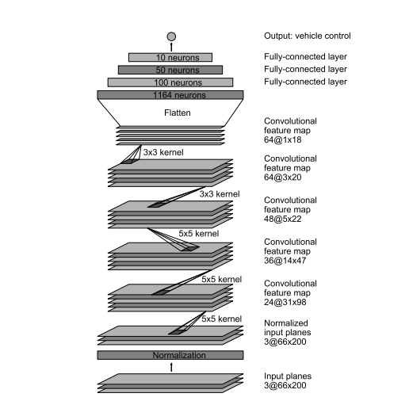
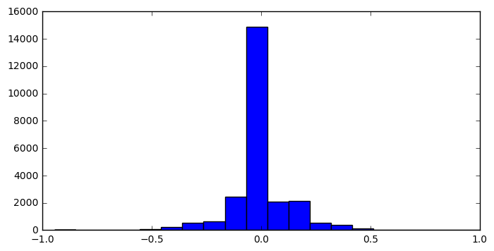
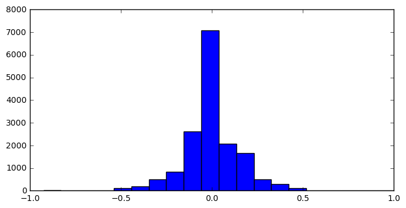
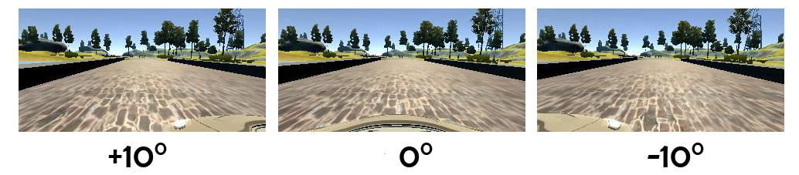
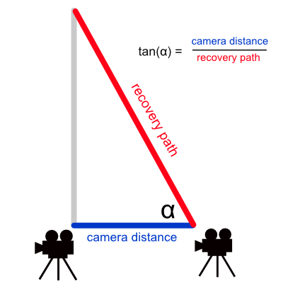
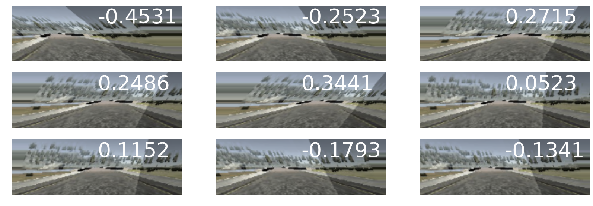
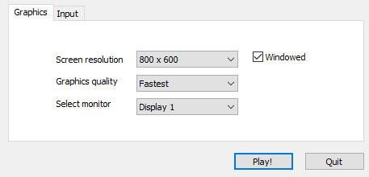

# Udacity SDC nanodegree - Behavioral cloning project

This is my submission for the behavioral cloning project of the Udacity Self-driving
car engineer nanodegree program. The solution is based on [Keras](http://keras.io), an machine learning library for Python.

## 1. Motivation and model architecture
Goal of this project is to let a car drive safely in a simulator by a machine learning model. The model takes raw camera pictures as inputs and has to
predict the steering angle of the car. To train the model I used the driving data which was provided by Udacity and therefore did not collect data on my own.


I based on the architecture proposed in [End to End Learning for Self-Driving Cars](https://arxiv.org/abs/1604.07316) by Nvidia.
An overview of the architecture is presented below:



The neural network used in the NVIDIA paper consists of an normalization layer followed by 5 convolutional layers
- Convolutional layer 1 has 24 kernels with a size of 5x5 and strides of [2,2]
- Convolutional layer 2 has 36 kernels with a size of 5x5 and strides of [2,2]
- Convolutional layer 3 has 48 kernels with a size of 3x3 and strides of [1,1]
- Convolutional layer 4 has 64 kernels with a size of 3x3 and strides of [1,1]
- Convolutional layer 5 has 64 kernels with a size of 3x3 and strides of [1,1]

These layers are followed by a flatten layer and then 3 fully-connected layers with 100, 50, 10 neurons and an output layer with 1 neuron
to predict the steering angle. The model uses 66x200 pictures as inputs.

### Adjustments and implementation details
In my implementation I used `Relu` as an acitvation function and included two `Dropout` layers to **compensate for overfitting**. For the normalization layer I used Keras' 'lambda' layer and normalized the inputs
by diving the inputs by 127.5 and then substracting 0.5. The normalization was adapted by the comma.ai [model](https://github.com/commaai/research/blob/master/train_steering_model.py).

Below is my final model:

```python
def NVIDIAmodel():
    model = Sequential()
    # Normalization layer
    model.add(Lambda(lambda x: x/127.5 - 1.0, input_shape=[66,200,3]))
    # Conv1
    model.add(Conv2D(24,5,5,border_mode="valid",subsample=[2,2]))
    model.add(Activation('relu'))
    #Conv2
    model.add(Conv2D(36,5,5,border_mode="valid",subsample=[2,2]))
    model.add(Activation('relu'))
    # Conv3
    model.add(Conv2D(48,5,5,border_mode="valid",subsample=[2,2]))
    model.add(Activation('relu'))
    # Conv4
    model.add(Conv2D(64,3,3,border_mode="valid",subsample=[1,1]))
    model.add(Activation('relu'))
    # Conv5
    model.add(Conv2D(64,3,3,border_mode="valid",subsample=[1,1]))
    model.add(Activation('relu'))
    # Flatten
    model.add(Flatten())
    model.add(Dropout(0.6))
    # FC1
    model.add(Dense(100))
    model.add(Dropout(0.4))
    model.add(Activation('relu'))
    # FC2
    model.add(Dense(50))
    model.add(Activation('relu'))
    # FC3
    model.add(Dense(10))
    model.add(Activation('relu'))
    # Output
    model.add(Dense(1))

    return model
```
The model consists of roughly 252.000 parameters and should therefore provide descent inference performance on embedded hardware like Jetson TX1.

## 2. Data Collection and Data Augmentation

I did not collect my own data but used the provided Udacity data instead. My pre-processing pipeline consists of the following steps:

- Resizing the images to 200x66 pixels
- Flipping images at random
- brightness and saturation adjustments
- Adding random shadows
- Vertical and horizontal shifts
- Perspective warping
- Multiple camera usage for recovery paths


### Filtering the dataset

The dataset collected by Udacity showed to be very biased towards small steering angles as can be shown in this histogram:

<p align="center">
  
</p>

To filter it I removed all the samples off the car while not driving - throttle < 0.1 and I also
and of the pictures with a steering angle < 0.02 I only kept 1.900 random pictures. The filtering resulted in this distribution:

<p align="center">
  
</p>

As one can see left and right steering angles are not evenly distributed. To have a model which is able to generalize well this might be an issue.
I did not apply additional filtering but compensated this problem by randomly flipping the images as described later.

### Multiple camera usage for recovery paths
One trick Nvidia does in their paper is to use images from multiple cameras for training. The motivation behind this is to
simulate recovery paths. If one is only to collect training data of the middle of the road, the car will not be able to recover when getting close to the lanes.
One strategy is to collect data while driving back from the side to the middle of the road. As this is not possible in a real world situation one can also simulate beeing of track
by using the side cameras and then add a small offset to it.



If we use an offset of 10° then we would add 10° to the steering of left camera pictures and substract 10° of
right camera pictures. The idea here is that if the car is left from the ideal path the it hast to make a right turn and when beeing
on the right side it has to make a left turn. The choice of the offset here is subjective.
A high offset angle can lead to aggressive driving behavior of the car. A small offset angle on the other side can result
in crashes.

If we assume that the cameras are 0.5m away from each other and we want the car to get back to the
ideal path in 10m then we can get the offset angle by:

<p align="center">
  
</p>

### Color adjustments

The saturation off the converted HSV image and the brightness got randomly
changed. I also added random shadow overlays using openCV. The function below illustrates the implementation:

```python
def color_image(image,op=0.7):
    hsv = cv2.cvtColor(image, cv2.COLOR_RGB2HSV)
    hsv[:,:,2]*=np.random.uniform(0.4,1.2)
    hsv[:,:,1]*=np.random.uniform(0.5,1)
    converted=cv2.cvtColor(hsv, cv2.COLOR_HSV2RGB)
    img = np.copy(converted)
    x=np.random.randint(100)
    y=-1*np.random.randint(40)+20
    width= 70
    width_sp=np.random.randint(350)-125
    s = np.random.choice(range(-60,100))
    skew = np.random.choice(range(-100,100)) # Skew of the shadow to the right or to the left
    tr = np.array([[0+s,110],[0+s+skew,0],[100+s+skew,0],[100+s,110]])
    op=np.random.uniform(0,op) # Opacitivy of the shadow
    f = np.copy(img)
    overlay = np.copy(img)
    cv2.fillPoly(overlay, [tr], -1)
    cv2.addWeighted(overlay, op, img, 1 - op, 0, img)
    return img
```
The only parameter which can be set by user is the opacity of shadows. The other adjustments are fixed.
You can see an example result below:

<p>
<p align="center">
  
</p>

### Shifting images

I also augmented the images by randomly cropping out a different part of the image.
This was implemented in `move_image` function which takes the horizontal and vertical
shift range as parameters.

Using `move_image(img,20,20)` will shift the images 20 pixel in width and height at random.
By default it will add/substract 0.001 to the steering angle per vertical shift.

<p align="center">
  
</p>

### Perspective warping
I followed the the instructions by [Kaspar Sakmann](https://medium.com/@ksakmann/behavioral-cloning-make-a-car-drive-like-yourself-dc6021152713#.f8gjijvhq)
and adapted his great working function for perspective warping of images. The function `warp_image` fixes the bottom pixels and shift the top portion of an
image to shift the perspective. The steering angle is then adjusted in accordance to the amount of shift. The function `persp_move(img,steer,warp_range)`
takes an image, steering angle and the warping range as input and the outputs adjusted steering angles and the augmented images:

<p align="center">
  
</p>

### Random flipping of images

Images get flipped by random with the following function. This is the first augmentation
function we call. Therefore it not only flips the image but also calculates the offset angle
as described above.

```python
def flip_image(image, offset,angle,off_ang):
    if np.random.randint(2)==1: #flip a coin. If 1 then flip the image.
        image = np.fliplr(image)
        new_angle = (-1)*angle-offset*off_ang # Also reverse the steering angle
    else:
        new_angle = angle + offset*off_ang
    return image,new_angle
```
### Implementation of data generator
All the augmentation was included into a custom data generator function.
The function takes a list of image files and the corresponding labels and offset data (which camera took the image) as input.
The generator `data_generator` works in the following way:

1. It shuffles the labels and pictures
2. It then iterates over the examples in batches as specified.
3. If there are not enough samples to generate a full batch it starts all over by shuffling.

Most of the data augmentation parameters can be passed to the generator. See `model.py` for more details.
The advantage off the generator


## 3. Traning the model
The model was trained using the following parameters:

```python
optimizer = Adam(lr=0.0001)
  model = NVIDIAmodel()
  model.compile(loss="MSE", optimizer=optimizer)
  ###  Parameters ####
  nb_epoch = 15 #number of epochs
  off_ang = 0.09 #offset angle of the cameras
  off_sh = off_ang/100 #angle adjustments when moving the pictures horizontally
  warp=65 #Range of perspective warping
  pvs = 10 # Vertical movements
  phs = 15 # Horizontal movements
  bz = 200 # batch size
  samples_per_epoch=20000
```
I decreased the learning rate to 0.0001 as this resulted in more stable results.
I used Adam optimizer and set the training examples per epoch to 20k as this roughly matched the amount
of pictures I used. The batch size was 200 - this was the maximum my graphics card (*NVidia GTX1080*) could handle.
I experimented with different epochs and found out that MSE ist not a valid score alone for anticipating if the car will stay on the road.


## 4. Testing and Evaluation

### Settings
I started the driving simulator using the following settings:



I saw that changing the screen size and graphics quality influences the model performance.


### Driving results on evaluation track
I tested my model using the second track. I did not use these data while traning.

The car was able to drive the test track without any crashes safely. Quite impressive for the amount of data used and the fast training time.
We see that sometimes the car
comes very close to the border. Changing the offset angle and playing with learning rate and number of epochs could
further optimize the model.

**Check out the performance by clicking on the image below:**

[](http://www.youtube.com/watch?v=YOUTUBE_VIDEO_ID_HERE "Performance on Test track")
